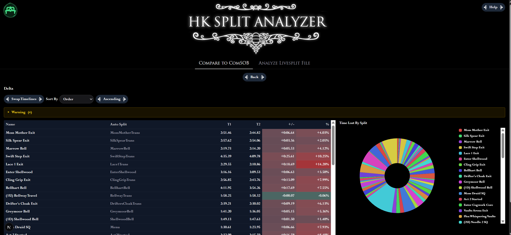
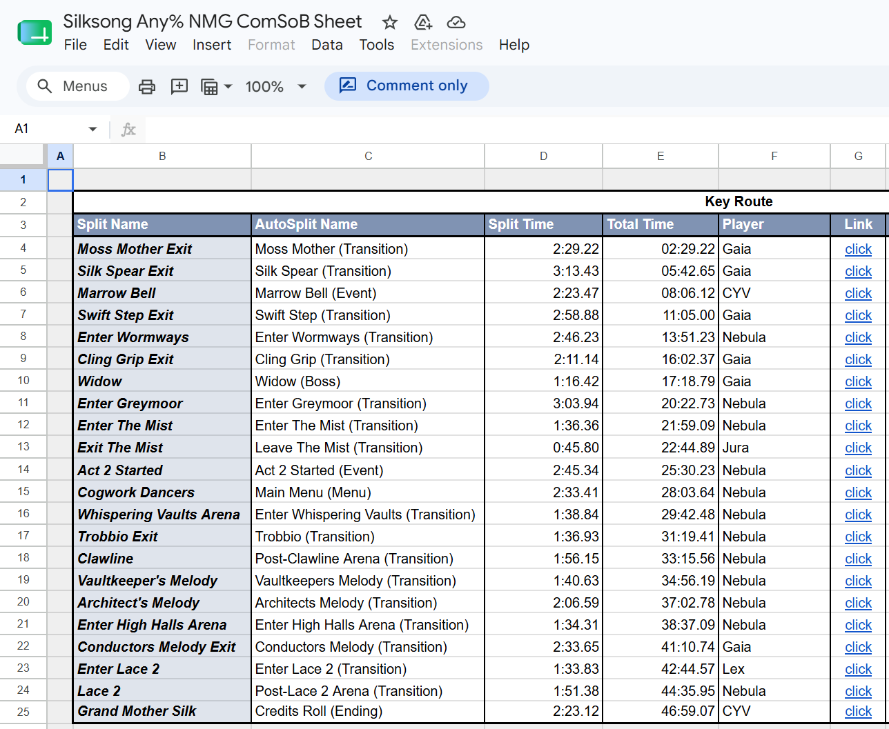
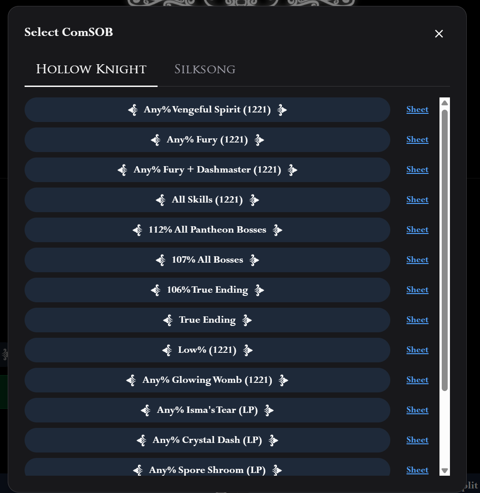
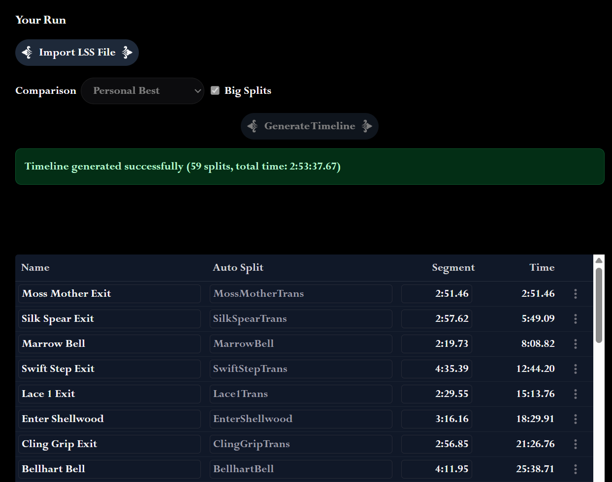
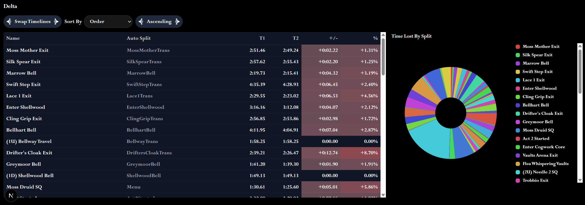

https://hksplitanalyzer.vercel.app/

## What is Hollow Knight Split Analyzer? (HKSA)

HKSA is a tool for speedrunners to compare their splits against different comparisons, such as their Personal Best, Best Segments, or the Community Sum of Best (ComSOB).

## What is a ComSOB?

A ComSOB is an individual level (IL) of a run that speedrunners like to practice in short segments.

Combining the best attempts from the community to create a run can simulate a theoretical sum of best that a human could (somewhat) realistically achieve.

For ComSOBs, HKSA will automatically fetch the most recent times from linked Google Sheets. Each Google Sheet will be directly linked.

## How to Import a LiveSplit File:

These instructions will pertain to the "Compare to ComSOB" tab since most users will use HKSA solely for this purpose.

1. Click "Import LSS" and navigate to your LiveSplit file.

2. Select the comparison you want to compare to (Personal Best, Best Segments, etc.).

3. Check the big splits option if you want to treat segments with subsplits as a single segment as most premade LSS files splits up ComSOBs into multiple splits (it won't impact lss files that don't have subsplits).

4. Click "Generate Timeline" and now you have your timeline to compare against!

## How to Compare to ComSOB

1. Click "Import ComSOB"

2. Select the game you're running and then select the route you want to compare against.

If your comparison is not listed on the ComSOBs there are several things you can do

- Leave an issue on the GitHub
- Fork this repository, modify lib/hk_comsob_data.json or lib/silksong_comsob_data.json, and create a pull request.
- Ping me on the HK Speedrunning Discord @bim (https://discord.gg/3JtHPsBjHD)
- Modify an existing ComSOB's timeline.

## How to Modify a Timeline

Each segment in a timeline will have the split's name, autosplit name, and segment time. Click on the textbox to modify it.

If you click on the three dots on the right, you can add a segment above, add a segment below, or delete a row.

**IMPORTANT** Make sure that your comparison and ComSOB comparison have the same number of segments. Otherwise the comparison may not be accurate.

## Analysis

The analysis includes a splits table showing your segment times, the comparison times, and the difference between them.

Segments where you are ahead of the comparison will be highlighted in green, while segments where you are behind will be highlighted in red.

The "Swap Timelines" button will switch the difference calculation.

To change the order of the splits, select the order parameter and whether you want it ascending or descending.

The pie chart shows all of the time loss (the red segments) in the run.
